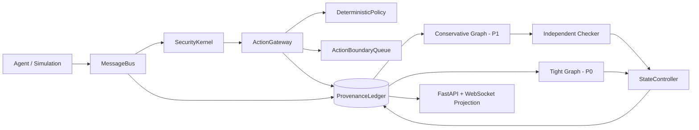

# MAJD-Guard

MAJD-Guard 是一个用于研究多智能体级联污染与防御的架构代码仓库。当前公开内容覆盖最终方案 v4 的 Phase 0–4：研究有效性约束、版本化 provenance、异构传播、完全中介的 action gateway、双图 RAISE 机制、独立 checker、状态修复和运行时可观测接口。

本仓库发布的是可复现的架构代码、测试、接口模型和文档，不发布具体运行数据、数据库、实验结果、私有模型凭据或外部 benchmark 数据集。

## Architecture



### Core invariants

- 所有 E1–E3 受保护动作通过 `ActionGateway`；模型证据只能否决，不能产生 `allow`。
- `effect_mode` 在 Gateway 构造时固定；dry-run 的 E2/E3 在 adapter 查找和调用前拒绝。
- Artifact 版本不可变，状态只能通过追加式 `state_transitions` 修改；invalidated 版本不能重新激活。
- conservative graph 用于安全判断和证书，tight graph 只能提出候选，不能单独批准 retention。
- retained 版本携带强制标签，不能作为 E2/E3 的 authority 参数；公开 API/WebSocket 使用统一 provenance projection 脱敏。
- 快照变化、未知 provenance、handler 异常、预算耗尽和不可逆副作用均 fail closed，并记录审计/补偿信息。
- `UNSATISFIABLE`（已证明不存在可用 break set）与 `UNKNOWN`（预算或图范围不足）保持独立语义。

## Repository layout

```text
backend/app/
├── actions/             # ActionRequest, contracts, policy, gateway, queue
├── api/routes/          # FastAPI routes, including provenance projection
├── entities/            # Versioned Memory/RAG adapters
├── provenance/          # Ledger, models, conservative/tight projections
├── state/               # StateController, retention, repair, labels
├── verification/        # Residual/runtime/certificate checkers
├── research/scale/      # Synthetic Phase 0.5 and Phase 4 mechanism modules
├── message_bus.py       # Commit, route, and public transport boundary
├── runtime.py           # RunManifest, RunContext, RunEngine
└── simulation/          # Topology-aware simulation runner

backend/tests/           # Unit, property, mutation, API, and integration tests
frontend/src/            # React operator UI and provenance summary
docs/                    # Phase 0–4 implementation notes and security docs
```

## Quick start

### Backend

```powershell
cd backend
python -m venv .venv
.\.venv\Scripts\Activate.ps1
pip install -r requirements.txt
Copy-Item .env.example .env
\.venv\Scripts\python.exe -m uvicorn app.main:app --reload --host 127.0.0.1 --port 8000
```

### Frontend

```powershell
cd frontend
npm install
npm run dev
```

The frontend uses `http://127.0.0.1:5173`; the backend API is available at `http://127.0.0.1:8000`.

Keep `LLM_ENABLED=false` for local architecture and test runs. API credentials must be supplied through environment variables and must never be committed.

## Verification

```powershell
# backend
cd backend
.\.venv\Scripts\python.exe -m pytest tests -q -p no:cacheprovider

# frontend
cd ..\frontend
npm run typecheck
npm test -- --run
```

The tests cover ledger append-only behavior, snapshot/TOCTOU checks, P0/P1 graph separation, action contracts, dry-run enforcement, overlapping/disjoint action queues, origin non-amplification, certificate/reissue bounds, exact-cover/brute-force agreement, attack/benign canaries, required-goal replay, retention labels, repair invariants, mutation rejection, and API/runtime regressions.

## API surface

- `GET /api/v1/provenance/{run_id}?mode=conservative|tight`
- `GET /api/v1/runs/{run_id}`
- `GET /api/v1/runs/{run_id}/events`
- `GET /api/v1/runs/{run_id}/metrics`
- `WS /ws/events`
- `WS /ws/runs/{run_id}`

Public responses are projections. Internal denial reasons, witness details, certificates and state transitions remain on the research/operations side and are not returned to agent context.

## Scope boundary

Included:

- Phase 0 / 0.5: label isolation, independent oracle boundaries, synthetic scale machinery and fail-closed regression coverage.
- Phase 1–2: versioned ledger, activities/relations/support groups, Memory/RAG versions, topology-aware propagation and run isolation.
- Phase 3: deterministic action contracts, effect/capability/scope checks, structured detector evidence, constant-delay denial, release/reissue policy and human-review cost estimate.
- Phase 4: conservative/tight projections, witness/cover solvers, independent checker, three-state semantics, certificate verification, retention/repair, post-state checks, labels and action-boundary queue.

Explicitly excluded from this repository release:

- Phase 5 external baseline reproduction.
- Phase 6 preregistered M/E/X experiments and paper-level statistical claims.
- AgentDojo/A2ASecBench external datasets or copied benchmark data.
- Runtime SQLite/Chroma stores, generated reports, logs, caches, model weights, secrets and private payloads.

## Data and contribution policy

Runtime data is ignored by `.gitignore` (`*.db`, `backend/data/`, Chroma stores, logs, temporary output and local QA artifacts). Before opening a pull request, inspect `git diff --cached --name-only` and confirm that only source code, tests and documentation are staged. Do not commit `.env`, API keys, raw payloads, generated experiment results or database files.

See [docs/Phase1-4核心运行实现报告.md](docs/Phase1-4核心运行实现报告.md) for the implementation mapping.
