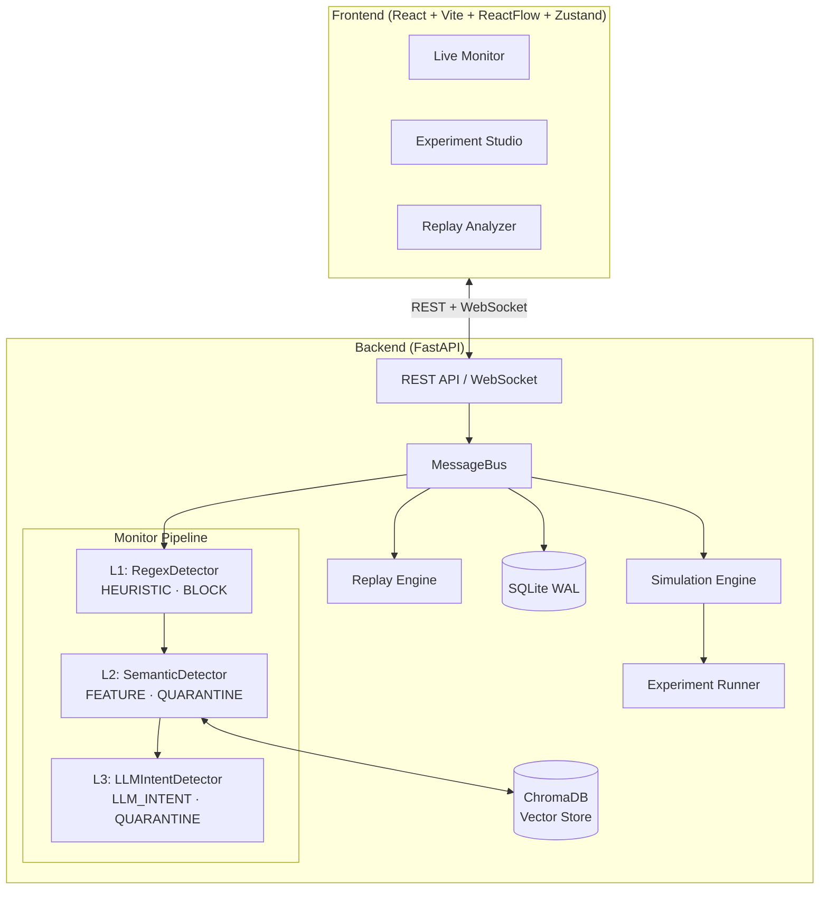

# Multi-Agent Cascading Pollution Detection & Defense Platform

A research and product platform for simulating, observing, recording, and replaying **Prompt Injection / RAG Context Poisoning / Tool Pollution Propagation** in multi-agent systems. Features a pluggable 3-level Monitor Pipeline with MiMo LLM detection for real-time alerting, blocking, and isolation.

## Architecture



## Defense Tiers

| Tier | Mechanism | Technology | Target | Action | Latency |
|------|-----------|-----------|--------|--------|---------|
| **L1 Regex** | Pattern matching (10+ regex rules) | Python `re`, YARA-compatible | Explicit jailbreak, hardcoded prompt injection | **BLOCK** | < 1ms |
| **L2 Semantic** | Embedding similarity search (20+ attack vectors) | ChromaDB, sentence-transformers | Variant attacks, semantic bypass, RAG poisoning | **QUARANTINE** | ~50ms |
| **L3 LLM Intent** | LLM judgment with structured JSON output | MiMo / DeepSeek / GPT-4o | Cognitive deception, social engineering, covert injection | **QUARANTINE** | ~500ms |

**Fail-Fast**: If L1 blocks, L2 and L3 are skipped. If L2 quarantines, L3 is skipped.

## Tech Stack

| Layer | Technology |
|-------|-----------|
| Backend | Python 3.11+, FastAPI, aiosqlite, Pydantic v2, httpx |
| Detection | Regex, ChromaDB + sentence-transformers, MiMo LLM |
| Frontend | TypeScript 5.6, React 18, Vite 5, Tailwind CSS 3.4 |
| Visualization | @xyflow/react (ReactFlow), lucide-react |
| State | Zustand 5 |
| Database | SQLite (WAL mode) + ChromaDB (persistent) |

## Quick Start

### Docker (Recommended)

```bash
docker compose up --build
```

- Frontend: `http://localhost:3000`
- Backend API docs: `http://localhost:8000/docs`
- WebSocket: `ws://localhost:8000/ws/events`

### Manual

**Backend**

```powershell
cd backend
python -m venv .venv
.\.venv\Scripts\Activate.ps1
pip install -r requirements.txt
Copy-Item .env.example .env
uvicorn app.main:app --reload --host 127.0.0.1 --port 8000
```

**Frontend**

```powershell
cd frontend
npm install
npm run dev
```

Open `http://127.0.0.1:5173`. The Vite dev server proxies `/api` to `http://127.0.0.1:8000` and `/ws` to the backend WebSocket automatically — no `.env` file needed for local development.

> **Docker users:** The frontend nginx proxies `/api/` and `/ws/` to the backend, so the app uses relative paths automatically.

### Offline Demo Mode

Set `LLM_ENABLED=false` in `backend/.env` — no API key required. All detectors (including L2 semantic via local embedding model) and simulation work fully offline.

## Project Structure

```
├── docker-compose.yml              # One-command deployment
├── backend/
│   ├── Dockerfile
│   ├── app/
│   │   ├── main.py                 # FastAPI entry (~28 REST + 1 WebSocket)
│   │   ├── schemas.py              # Pydantic models & enums
│   │   ├── message_bus.py          # Central async event routing
│   │   ├── event_store.py          # SQLite persistence (WAL)
│   │   ├── vector_store.py         # ChromaDB vector store (L2 semantic)
│   │   ├── websocket_manager.py    # WebSocket broadcast
│   │   ├── playbooks.py            # 6 attack/defense scenarios
│   │   ├── detectors/
│   │   │   ├── pipeline.py         # Chain-of-responsibility + PolicyEngine + Bayesian fusion
│   │   │   ├── factory.py          # Pipeline factory (reads runtime settings)
│   │   │   ├── regex_detector.py   # L1: pattern matching
│   │   │   ├── semantic_detector.py # L2: embedding similarity
│   │   │   ├── rag_detector.py     # L2 legacy (deprecated keyword matching)
│   │   │   └── llm_detector.py     # L3: LLM intent judgment
│   │   ├── simulation/             # Turn-based simulation engine
│   │   ├── experiments/            # Reproducible experiment runner + 10 metrics
│   │   ├── replay/                 # Cursor-based trace replay
│   │   ├── benchmark/              # Automated pipeline benchmarking
│   │   ├── policy/                 # Policy engine (wired into runtime pipeline)
│   │   ├── trace_graph/            # TraceGraph builder + contamination analyzer
│   │   └── llm/                    # LLM provider abstraction
│   ├── tests/
│   │   ├── test_contract.py        # Core data-integrity contract tests
│   │   ├── test_policy_engine.py   # Policy evaluation unit tests
│   │   ├── test_trace_graph_builder.py
│   │   ├── test_contamination_analyzer.py
│   │   └── test_event_store_migration.py
│   └── requirements.txt
├── frontend/
│   ├── Dockerfile
│   ├── nginx.conf
│   └── src/
│       ├── pages/
│       │   ├── LiveMonitor.tsx      # Real-time topology + event console
│       │   ├── ExperimentStudio.tsx # Experiment runner + metrics
│       │   ├── ReplayAnalyzer.tsx   # Step-through trace playback
│       │   └── SettingsPage.tsx     # Runtime configuration console
│       ├── components/
│       │   ├── AgentNode.tsx        # Custom ReactFlow node (animated)
│       │   ├── EventConsole.tsx     # Real-time security console
│       │   ├── MonitorStatusPanel.tsx # Pipeline status overlay (draggable)
│       │   ├── NodeDetailPanel.tsx  # Node detail popover
│       │   ├── PlaybookPanel.tsx    # One-click attack scenarios (draggable)
│       │   ├── SettingsSection.tsx  # Reusable settings category card
│       │   └── Toast.tsx            # Toast notification component
│       ├── hooks/
│       │   └── useDraggable.ts      # Drag-to-reposition hook
│       ├── i18n/
│       │   ├── context.tsx          # LanguageProvider + useT hook
│       │   ├── en.json              # English translations
│       │   └── zh.json              # Chinese translations
│       ├── store.ts                 # Zustand global state
│       ├── api.ts                   # Backend API client (relative paths)
│       └── types.ts                 # TypeScript definitions
└── .dockerignore
```

## Key Capabilities

- **3-Level Monitor Pipeline** — L1 Regex (BLOCK) → L2 Semantic/Embedding (QUARANTINE) → L3 LLM Intent (QUARANTINE), with fail-fast short-circuit
- **Multi-Agent Simulation Engine** — Configurable topology, injection sources, turn-based LLM-driven conversations
- **Event Store & Trace System** — SQLite WAL persistence, trace_id-based causal chain tracking, full replay
- **Experiment System** — Reproducible experiments with 10 automated metrics
- **Benchmark System** — 29 built-in payloads (19 attack + 10 safe), per-level recall/FPR/latency stats, persisted to SQLite
- **Replay Engine** — Cursor-based trace step-through with play/pause/seek/speed (0.1x–16x)
- **Visual Console** — ReactFlow topology with real-time infection ripple, edge contamination pulse, quarantine animation
- **Monitor Status Panel** — Real-time per-level interception counts and detection reasons
- **6 Built-in Playbooks** — EventSpec template pattern ensures each run produces a fresh trace with unique IDs
- **Policy Engine** — Rule-based action decisions wired into the runtime detector pipeline, not just a standalone API
- **Contamination Analysis** — Propagation depth, blast radius, time-to-detection, recovery success, persistence metrics
- **Runtime Settings** — Settings changes (detector thresholds, LLM config) trigger live pipeline rebuild without restart
- **Contract Tests** — 11 automated tests covering playbook isolation, block semantics, trace propagation, and pipeline integrity

## TraceGraph & Contamination Analysis

The platform reconstructs event streams into TraceGraph objects and computes contamination propagation metrics such as propagation depth, blast radius, time-to-detection, recovery success, and contamination persistence. See [docs/trace-graph.md](docs/trace-graph.md) for details.

## Policy Engine

A rule-based policy engine sits between detection and action in the runtime pipeline, evaluating events against configurable policies to determine response actions. Policies can upgrade (but never downgrade) detector-level decisions. See [docs/policy-engine.md](docs/policy-engine.md) for details.

## API Endpoints

| Method | Path | Description |
|--------|------|-------------|
| GET | `/api/events` | Query events by trace, severity, status |
| GET | `/api/traces` | List all trace summaries |
| GET | `/api/traces/{id}` | Full trace replay |
| GET | `/api/traces/{id}/graph` | Get TraceGraph for a trace |
| GET | `/api/traces/{id}/contamination` | Get contamination metrics for a trace |
| DELETE | `/api/traces/{id}` | Delete a trace |
| GET | `/api/settings` | Get all settings categories |
| GET | `/api/settings/{category}` | Get settings for a category |
| PUT | `/api/settings/{category}` | Update settings for a category |
| POST | `/api/settings/{category}/reset` | Reset a category to defaults |
| GET | `/api/policies` | List active policies |
| POST | `/api/policies/evaluate` | Evaluate a policy against an event |
| GET | `/api/playbooks` | List playbook scenarios |
| POST | `/api/playbooks/{id}/run` | Run a playbook (streams via WebSocket) |
| POST | `/api/experiments` | Create and run an experiment |
| GET | `/api/experiments` | List all experiments |
| GET | `/api/experiments/{id}/metrics` | Get experiment metrics |
| POST | `/api/replay/{trace_id}/start` | Start replay session |
| POST | `/api/replay/{sid}/step` | Step forward/backward |
| POST | `/api/replay/{sid}/seek` | Seek to position |
| POST | `/api/benchmark/run` | Run benchmark (29 payloads) |
| GET | `/api/benchmark/reports` | List benchmark reports |
| GET | `/api/benchmark/reports/{id}` | Get benchmark report |

WebSocket (dev): `ws://127.0.0.1:8000/ws/events`
WebSocket (Docker): `ws://localhost:3000/ws/events` (proxied by nginx)

## License

MIT
