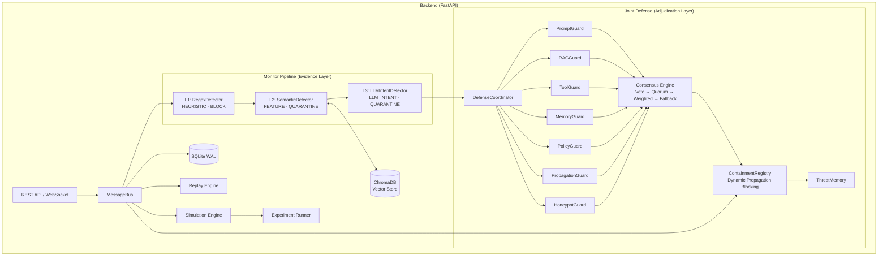

# Multi-Agent Cascading Pollution Detection & Defense Platform

A research and product platform for simulating, observing, recording, and replaying **Prompt Injection / RAG Context Poisoning / Tool Pollution Propagation** in multi-agent systems. Features a pluggable 3-level Monitor Pipeline with MiMo LLM detection, plus a **Multi-Agent Joint Defense Coordinator** with 7 specialized guard agents, weighted consensus voting, dynamic containment, and propagation blocking.

## Architecture



## Defense Layers

### Detection (Evidence Collection)

| Tier | Mechanism | Technology | Target | Action | Latency |
|------|-----------|-----------|--------|--------|---------|
| **L1 Regex** | Pattern matching (10+ regex rules) | Python `re`, YARA-compatible | Explicit jailbreak, hardcoded prompt injection | **BLOCK** | < 1ms |
| **L2 Semantic** | Embedding similarity search (20+ attack vectors) | ChromaDB, sentence-transformers | Variant attacks, semantic bypass, RAG poisoning | **QUARANTINE** | ~50ms |
| **L3 LLM Intent** | LLM judgment with structured JSON output | MiMo / DeepSeek / GPT-4o | Cognitive deception, social engineering, covert injection | **QUARANTINE** | ~500ms |

**Fail-Fast**: If L1 blocks, L2 and L3 are skipped. If L2 quarantines, L3 is skipped.

### Joint Defense (Adjudication)

After the detection pipeline collects evidence, the **DefenseCoordinator** runs 7 specialized guard agents in parallel, each producing a weighted verdict. A 4-tier consensus engine aggregates votes:

| Guard | Weight | Focus | Typical Recommendation |
|-------|--------|-------|----------------------|
| **PromptGuardAgent** | 1.2 | Prompt injection, jailbreak, role hijacking | block |
| **RAGGuardAgent** | 1.1 | RAG context pollution, fake trusted paragraphs | quarantine |
| **ToolGuardAgent** | 1.3 | Unauthorized/dangerous tool calls | block |
| **MemoryGuardAgent** | 1.2 | Memory poisoning, untrusted writes | block |
| **PolicyGuardAgent** | 1.4 | Wraps existing PolicyEngine rules | block/quarantine |
| **PropagationGuardAgent** | 1.5 | Blast radius, chain contamination | isolate |
| **HoneypotGuardAgent** | 0.8 | Gray-zone detection → decoy routing | decoy |

**Consensus Tiers**: Veto (single high-confidence malicious) → Quorum (ToolGuard+PolicyGuard) → Weighted vote → Fallback allow.

**Containment**: The `ContainmentRegistry` enforces dynamic propagation blocking in `MessageBus.publish()` — quarantined nodes, isolated tools, blocked edges, and revoked memory keys are intercepted before message delivery.

## Tech Stack

| Layer | Technology |
|-------|-----------|
| Backend | Python 3.11+, FastAPI, aiosqlite, Pydantic v2, httpx |
| Detection | Regex, ChromaDB + sentence-transformers, MiMo LLM |
| Database | SQLite (WAL mode) + ChromaDB (persistent) |

## Quick Start

### Docker (Recommended)

```bash
docker compose up --build
```

- Backend API docs: `http://localhost:8000/docs`
- Health check: `http://localhost:8000/health`
- WebSocket: `ws://localhost:8000/ws/events`

### Manual

```powershell
cd backend
python -m venv .venv
.\.venv\Scripts\Activate.ps1
pip install -r requirements.txt
Copy-Item .env.example .env
uvicorn app.main:app --reload --host 127.0.0.1 --port 8000
```

### Offline Demo Mode

Set `LLM_ENABLED=false` in `backend/.env` — no API key required. All detectors (including L2 semantic via local embedding model) and simulation work fully offline.

## Project Structure

```
├── docker-compose.yml              # One-command deployment
├── backend/
│   ├── Dockerfile
│   ├── app/
│   │   ├── main.py                 # FastAPI entry (create_app factory)
│   │   ├── api/
│   │   │   └── routes/             # APIRouter modules per domain
│   │   │       ├── health.py       # /health, /api/platform/config
│   │   │       ├── settings.py     # /api/v1/settings/*
│   │   │       ├── events.py       # /api/v1/events/*
│   │   │       ├── traces.py       # /api/v1/traces/*
│   │   │       ├── tasks.py        # /api/v1/tasks/*
│   │   │       ├── policies.py     # /api/v1/policies/*
│   │   │       ├── playbooks.py    # /api/v1/playbooks/*
│   │   │       ├── experiments.py  # /api/v1/experiments/*
│   │   │       ├── replay.py       # /api/v1/replay/*
│   │   │       ├── benchmark.py    # /api/v1/benchmark/*
│   │   │       ├── honeypot.py     # /api/v1/honeypot/*
│   │   │       ├── defense.py      # /api/v1/defense/*
│   │   │       └── websocket.py    # /ws/events
│   │   ├── core/
│   │   │   ├── config.py           # Settings + CORS helpers
│   │   │   ├── lifespan.py         # Startup/shutdown lifecycle
│   │   │   └── errors.py           # Error handlers
│   │   ├── services/               # Business logic layer
│   │   │   ├── event_service.py
│   │   │   ├── trace_service.py
│   │   │   ├── replay_service.py
│   │   │   ├── experiment_service.py
│   │   │   ├── benchmark_service.py
│   │   │   └── settings_service.py
│   │   ├── schemas/                # Pydantic models per domain
│   │   │   ├── common.py           # Enums & helpers
│   │   │   ├── events.py           # AgentEvent, EventSpec
│   │   │   ├── traces.py           # TraceSummary
│   │   │   ├── experiments.py      # Experiment configs & metrics
│   │   │   ├── replay.py           # ReplaySession, ReplayState
│   │   │   ├── settings.py         # Settings models
│   │   │   ├── benchmark.py        # BenchmarkReport, LevelStats
│   │   │   └── honeypot.py         # ThreatIntelReport
│   │   ├── message_bus.py          # Central async event routing
│   │   ├── event_store.py          # SQLite persistence (WAL)
│   │   ├── pipeline_manager.py     # Pipeline lifecycle (rebuilds on settings change)
│   │   ├── settings_manager.py     # Runtime settings persistence (SQLite)
│   │   ├── vector_store.py         # ChromaDB vector store (L2 semantic)
│   │   ├── websocket_manager.py    # WebSocket broadcast
│   │   ├── playbooks.py            # 6 attack/defense scenarios
│   │   ├── detectors/
│   │   │   ├── pipeline.py         # Chain-of-responsibility + PolicyEngine + Bayesian fusion
│   │   │   ├── factory.py          # Pipeline factory (reads runtime settings)
│   │   │   ├── regex_detector.py   # L1: pattern matching
│   │   │   ├── semantic_detector.py # L2: embedding similarity
│   │   │   ├── rag_detector.py     # L2 legacy (deprecated keyword matching)
│   │   │   └── llm_detector.py     # L3: LLM intent judgment
│   │   ├── simulation/             # Turn-based simulation engine
│   │   ├── experiments/            # Reproducible experiment runner + 10 metrics
│   │   ├── replay/                 # Cursor-based trace replay
│   │   ├── benchmark/              # Automated pipeline benchmarking
│   │   ├── policy/                 # Policy engine (wired into runtime pipeline)
│   │   ├── trace_graph/            # TraceGraph builder + contamination analyzer
│   │   ├── defense/                # Multi-Agent Joint Defense
│   │   │   ├── coordinator.py      # DefenseCoordinator (adjudication layer)
│   │   │   ├── consensus.py        # 4-tier consensus engine
│   │   │   ├── containment.py      # ContainmentRegistry + ContainmentPlanner
│   │   │   ├── threat_memory.py    # Shared threat intelligence memory
│   │   │   ├── manager.py          # Singleton factory
│   │   │   └── guards/             # 7 specialized defender agents
│   │   │       ├── prompt_guard.py
│   │   │       ├── rag_guard.py
│   │   │       ├── tool_guard.py
│   │   │       ├── memory_guard.py
│   │   │       ├── policy_guard.py
│   │   │       ├── propagation_guard.py
│   │   │       ├── honeypot_guard.py
│   │   │       └── recovery_agent.py
│   │   └── llm/                    # LLM provider abstraction
│   │       ├── client_manager.py   # LLM client lifecycle (reads runtime settings)
│   │       ├── factory.py          # Client factory
│   │       ├── mimo_client.py      # MiMo API client
│   │       └── base.py             # LLMClient protocol
│   ├── tests/
│   │   ├── conftest.py             # TestClient + temp DB fixtures
│   │   ├── test_contract.py        # Core data-integrity contract tests
│   │   ├── test_policy_engine.py   # Policy evaluation unit tests
│   │   ├── test_trace_graph_builder.py
│   │   ├── test_contamination_analyzer.py
│   │   ├── test_event_store_migration.py
│   │   └── api/                    # API-level route tests
│   │       ├── test_health_api.py
│   │       ├── test_events_api.py
│   │       ├── test_traces_api.py
│   │       ├── test_settings_api.py
│   │       ├── test_replay_api.py
│   │       └── test_benchmark_api.py
│   └── requirements.txt
```

## Key Capabilities

- **3-Level Monitor Pipeline** — L1 Regex (BLOCK) → L2 Semantic/Embedding (QUARANTINE) → L3 LLM Intent (QUARANTINE), with fail-fast short-circuit and Bayesian confidence fusion
- **Multi-Agent Joint Defense** — 7 specialized guard agents run in parallel after detection; 4-tier consensus (veto → quorum → weighted → fallback) aggregates weighted votes into a unified JointDefenseDecision; ContainmentRegistry enforces dynamic propagation blocking in the MessageBus
- **Containment & Recovery** — Quarantined nodes, isolated tools, blocked edges, and revoked memory keys are intercepted before message delivery; RecoveryAgent evaluates release conditions
- **Threat Memory** — Shared in-memory threat intelligence accumulates node risk scores, known attack indicators, and contaminated trace history across defense decisions
- **Multi-Agent Simulation Engine** — Configurable topology, injection sources, turn-based LLM-driven conversations
- **Event Store & Trace System** — SQLite WAL persistence with full AgentEvent JSON serialization (all v2 fields preserved on round-trip), trace_id-based causal chain tracking, full replay
- **Experiment System** — Reproducible experiments with 10 automated metrics
- **Benchmark System** — 29 built-in payloads (19 attack + 10 safe), per-level recall/FPR/latency stats, persisted to SQLite
- **Replay Engine** — Cursor-based trace step-through with play/pause/seek/speed (0.1x–16x)
- **6 Built-in Playbooks** — EventSpec template pattern ensures each run produces a fresh trace with unique IDs
- **Policy Engine** — Rule-based action decisions wired into runtime pipeline; actively enforces block/isolate/quarantine by updating `action_taken` and `status` on events, not just audit
- **Contamination Analysis** — Propagation depth, blast radius, time-to-detection, recovery success, persistence metrics
- **Runtime Settings** — Per-detector enable/disable (regex, semantic, llm_intent), threshold tuning, and LLM config changes trigger live pipeline rebuild with fresh LLM client (no restart required); reset restores factory defaults and rebuilds pipeline
- **Test Suite** — 90 tests: 23 API-level route tests + 67 unit/integration tests (10 consensus, 12 containment, 7 defense coordinator, 6 pipeline joint defense, 6 policy engine, 5 trace graph, 5 contamination, 5 event store migration, 11 contract)

## TraceGraph & Contamination Analysis

The platform reconstructs event streams into TraceGraph objects and computes contamination propagation metrics such as propagation depth, blast radius, time-to-detection, recovery success, and contamination persistence. See [docs/trace-graph.md](docs/trace-graph.md) for details.

## Policy Engine

A rule-based policy engine sits between detection and action in the runtime pipeline, evaluating events against configurable policies to determine response actions. Policies can upgrade (but never downgrade) detector-level decisions. See [docs/policy-engine.md](docs/policy-engine.md) for details.

## API Endpoints

| Method | Path | Description |
|--------|------|-------------|
| GET | `/health` | Health check |
| GET | `/api/platform/config` | Platform configuration |
| GET | `/api/v1/events` | Query events by trace, severity, status |
| POST | `/api/v1/events/broadcast` | Broadcast an event to WebSocket clients |
| GET | `/api/v1/events/latest` | Get latest events |
| GET | `/api/v1/events/{event_id}` | Get event by ID |
| POST | `/api/v1/tasks/demo` | Run demo gateway-to-agent task |
| POST | `/api/v1/tasks/tool-demo` | Run demo agent-to-tool task |
| GET | `/api/v1/traces` | List all trace summaries |
| GET | `/api/v1/traces/{id}` | Full trace replay |
| GET | `/api/v1/traces/{id}/summary` | Get trace summary |
| GET | `/api/v1/traces/{id}/graph` | Get TraceGraph for a trace |
| GET | `/api/v1/traces/{id}/contamination` | Get contamination metrics for a trace |
| DELETE | `/api/v1/traces/{id}` | Delete a trace |
| GET | `/api/v1/settings` | Get all settings categories |
| GET | `/api/v1/settings/{category}` | Get settings for a category |
| PUT | `/api/v1/settings/{category}` | Update settings for a category |
| POST | `/api/v1/settings/{category}/reset` | Reset a category to defaults |
| GET | `/api/v1/policies` | List active policies |
| POST | `/api/v1/policies/evaluate` | Evaluate a policy against an event |
| GET | `/api/v1/playbooks` | List playbook scenarios |
| POST | `/api/v1/playbooks/{id}/run` | Run a playbook (streams via WebSocket) |
| POST | `/api/v1/experiments` | Create and run an experiment |
| GET | `/api/v1/experiments` | List all experiments |
| GET | `/api/v1/experiments/{id}` | Get experiment details |
| GET | `/api/v1/experiments/{id}/trace` | Get experiment trace |
| GET | `/api/v1/experiments/{id}/metrics` | Get experiment metrics |
| DELETE | `/api/v1/experiments/{id}` | Delete an experiment |
| POST | `/api/v1/replay/{trace_id}/start` | Start replay session |
| POST | `/api/v1/replay/{sid}/pause` | Pause replay |
| POST | `/api/v1/replay/{sid}/resume` | Resume replay |
| POST | `/api/v1/replay/{sid}/step` | Step forward |
| POST | `/api/v1/replay/{sid}/seek` | Seek to position |
| POST | `/api/v1/replay/{sid}/speed` | Set replay speed |
| GET | `/api/v1/replay/{sid}/state` | Get replay state |
| POST | `/api/v1/benchmark/run` | Run benchmark (29 payloads) |
| GET | `/api/v1/benchmark/reports` | List benchmark reports |
| GET | `/api/v1/benchmark/reports/{id}` | Get benchmark report |
| GET | `/api/v1/honeypot/intel` | Get honeypot threat intelligence |
| POST | `/api/v1/honeypot/intel/feed-vector` | Feed novel honeypot payloads to vector store |
| GET | `/api/v1/defense/memory` | Get threat memory snapshot |
| GET | `/api/v1/defense/decisions/latest` | Get recent joint defense decisions |
| GET | `/api/v1/defense/containment/status` | Get full containment state |
| POST | `/api/v1/defense/containment/release/node/{node_id}` | Release a quarantined node |
| POST | `/api/v1/defense/containment/release/tool/{tool_id}` | Release an isolated tool |
| POST | `/api/v1/defense/containment/release/edge` | Unblock an edge (source, target) |
| POST | `/api/v1/defense/containment/release/memory/{key}` | Restore a revoked memory key |
| POST | `/api/v1/defense/recovery/check/{node_id}` | Check if a node can be recovered |
| POST | `/api/v1/defense/recovery/approve/{node_id}` | Approve recovery and emit RECOVERY event |

WebSocket: `ws://127.0.0.1:8000/ws/events`

## License

MIT
